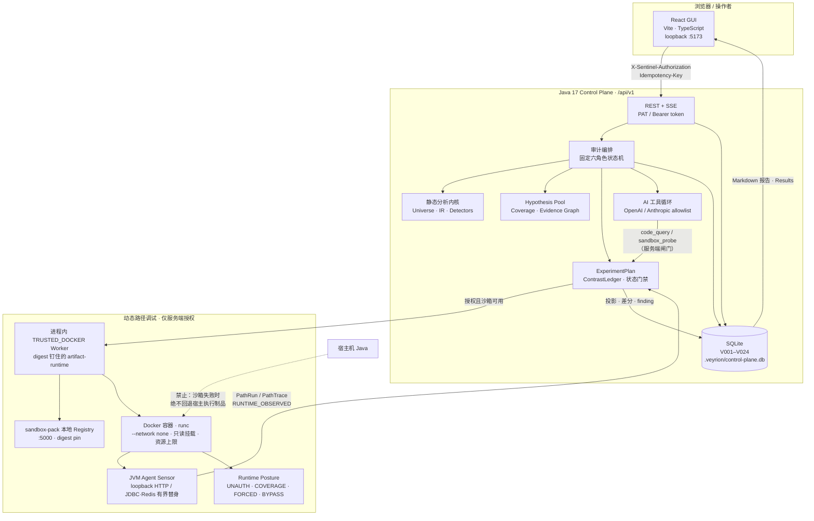
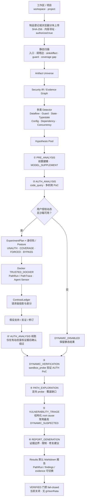
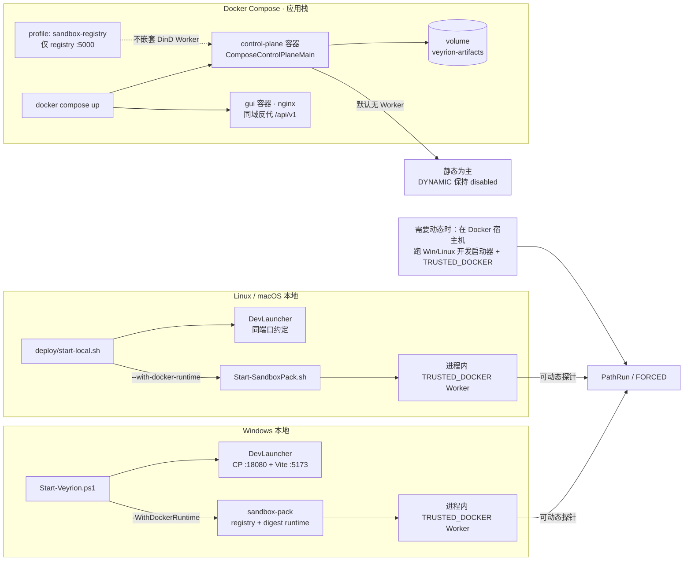

# 溯脉 · Veyrion

Veyrion 是面向**已明确授权**的闭源 JVM 制品的本地路径调试型安全验证工具。它把静态事实、受控动态实验、AI 辅助研判和可追溯证据组织成固定审计流程，帮助建立入口、鉴权、路径、依赖副作用与攻击链之间的可引用关系。

兼容标识保持不变：Java package `com.aq.jvmsentinel`，Maven artifactId `jvm-security-verifier`，API 前缀 `/api/v1`。

---

## 1. 功能说明

| 维度 | 能力 |
|------|------|
| 形态 | 个人本地版：React/TypeScript/Vite GUI + Java 17 Control Plane + 单节点 SQLite |
| 目标制品 | 优先 Spring Boot 可执行 JAR；JAR/WAR/CLASS 可做有界静态读取；浏览器分块上传后进入内容寻址目录 |
| 静态分析 | Spring MVC / 鉴权注解、调用边、TaintPath、sink（owner 限定；同调用点可多 kind）、GuardSurface、coverage gap |
| 确定性引擎 | Artifact Universe → Security IR / Evidence Graph → 多类 Detector → Hypothesis Pool → ExperimentPlan → PathRun 投影 → ContrastLedger（**不占 AI 席位**） |
| 六个 AI 角色 | `PRE_ANALYSIS` → `AUTH_ANALYSIS` → `DYNAMIC_VERIFICATION` → `PATH_EXPLORATION` → `VULNERABILITY_TRIAGE` → `REPORT_GENERATION`（模型不能增删或重排） |
| 动态执行 | Docker 内路径调试：TracePlan、World Pack、Runtime Posture（`UNAUTH` / `COVERAGE_POSTURE` / Docker-only `FORCED_REACHABILITY` / `BYPASS`）、JVM Agent Sensor、PathTrace |
| 结果 | PathRun、ContrastLedger、finding、Hypothesis、Coverage、Markdown 报告；GUI Results 默认展示最终 MD 报告 |
| CLI | 有界静态读取（必须 `--authorize`）；不解压 JAR/WAR 到磁盘 |

### 1.1 明确边界（诚实声明）

- **不是**生产攻击平台；不承诺任意语言、完整多租户、企业 SSO、100% 路径覆盖。
- **`VERIFIED` 门禁当前关闭**（fail-closed）。没有 gVisor/Kata 逃逸套件和可重放强化隔离证据，不得宣称生产可用或恶意制品隔离已验证。
- **`TRUSTED_DOCKER`** 是普通 runc + `--network none` 的受信本地调试后端，只面向用户信任、由后端管理并重新校验摘要的内部 JAR；**不是** gVisor/Kata。
- 沙箱不可用时动态能力保持 `DYNAMIC_DISABLED` / disabled，**绝不回退到宿主机 Java 执行制品**。
- `FORCED_REACHABILITY` 仅在沙箱内对已识别 auth/role/permission/license/feature guard 短接，必须标 `INSTRUMENTATION_REACHABILITY`；**仅强达/2xx/入口不能确认**；危险 sink 效果闭环可升 `DYNAMIC_CONFIRMED` 并标注 `requiredPrivilege`（`VERIFIED` 仍关）。
- AI、前端、MOCK/规则生成不能补写 `FACT` 或单独提升验证状态。
- 不保证“发现所有非常规漏洞”；系统用 coverage gap、停止原因和 provenance 保持诚实。

### 1.2 证据与验证状态

| 证据层 | 含义 |
|--------|------|
| `FACT` | 制品、字节码或控制面直接确认 |
| `RUNTIME_OBSERVED` | 授权沙箱中的运行时观测 |
| `MOCK` / `RULE_GENERATED` | 替身或规则生成（不得写成真实环境验证） |
| `INFERENCE` | 静态分析或模型推断 |

| 验证状态 | 含义 |
|----------|------|
| `STATIC_INFERRED` | 静态事实或分析表明可能可达 |
| `DYNAMIC_SUSPECTED` | 受控运行到达关键点，但闭环不足 |
| `DYNAMIC_CONFIRMED` | 满足服务端 H3 SQL / H4 sink-effect 门禁，并投影所需权限；不等于生产实库证实 |
| `VERIFIED` | 强化隔离 + 可重放证据；**当前关闭** |
| `UNREACHED` | 身份、预算、启动、超时或依赖限制导致未覆盖 |

动态结论必须关联 PathRun。静态候选可以没有 PathRun，但必须保留静态证据和停止原因。动态失败、`UNKNOWN`/`-1`/`MOCK` 和空投影不得进入疑似漏洞主列表。

### 1.3 六个 AI 角色（研判层，非基础召回）

| 角色 | 职责 |
|------|------|
| `PRE_ANALYSIS` | 解释静态入口、依赖和 sink；补充候选只能标 `MODEL_SUPPLEMENT`，不得覆盖 FACT |
| `AUTH_ANALYSIS` | 用 `code_query` 阅读真实鉴权实现；有界多轮：查代码 → 草拟 PoC → 补证 → 修订；有动态鉴权证据后可续跑确认绕过 |
| `DYNAMIC_VERIFICATION` | 在服务端固定策略下用 `sandbox_probe` 验证 AUTH PoC |
| `PATH_EXPLORATION` | 为明确 coverage gap 做定向 `sandbox_probe`；新事实回写 PathRun |
| `VULNERABILITY_TRIAGE` | 复现或证伪；只消费成功投影的证据；输出结构化 root cause |
| `REPORT_GENERATION` | 汇总证据边界、路径、对照账本、限制和修复建议；**不提升**验证状态 |

模型只能调用服务端 allowlist 工具，不能获得 shell、宿主路径、外网或策略修改能力。提示词可编辑，但不能改变工具白名单、沙箱策略、预算或验证等级。

---

## 2. 产品架构



**组件边界一句话：** GUI 只谈 `/api/v1`；Control Plane 拥有 SQLite、权限、沙箱策略和验证门禁；Worker 只跑 digest 钉住的容器；AI 不能改策略或补写 FACT。

---

## 3. 完整审计执行流程



### 3.1 确定性发现闭环（AI 之前）

```text
Artifact Universe
  → Security IR / Evidence Graph
  → Detectors（污点只是其中一类）
  → Hypothesis Pool
  → 服务端 ExperimentPlan
  → PathRun / RuntimeObservation
  → 请求级投影与 ContrastLedger
  → 受影响子图重算、假设修订或证伪
```

### 3.2 动态姿态（Docker 沙箱内）

| Posture | 作用 |
|---------|------|
| `UNAUTH` | 未授权轨：标出鉴权墙 |
| `COVERAGE_POSTURE` | 特权/业务覆盖轨：有界业务路径探索（失败前路径仍记录） |
| `FORCED_REACHABILITY` | Docker-only：短接已识别 guard；标 `INSTRUMENTATION_REACHABILITY`；无 sink 效果不确认，有 H4 效果可确认+权限 |
| `BYPASS` | 有证据后的绕过组合（不得把 Bypass Zoo 当主召回） |

目标不是保证所有接口完整 2xx，而是即使因数据库、License、文件或依赖失败，也保留失败前真实业务路径、参数流、sink/effect 和退出原因。

---

## 4. 部署路径总览（Win / Linux / Compose）



| 路径 | 入口 | GUI | API | 动态 TRUSTED_DOCKER |
|------|------|-----|-----|---------------------|
| Windows 本地 | `.\Start-Veyrion.ps1` | `127.0.0.1:5173` | `127.0.0.1:18080/api/v1` | 加 `-WithDockerRuntime` |
| Linux/macOS 本地 | `./deploy/start-local.sh` | 同上 | 同上 | 加 `--with-docker-runtime` |
| Docker Compose | `docker compose up -d` | 同上（nginx） | 同上 | **不内嵌**；动态请在宿主机开发启动器启用 |

默认 SQLite：`<Artifacts>/.veyrion/control-plane.db`（本地默认 Artifacts = `samples`）。Compose 数据在 volume `veyrion-artifacts` → 容器 `/data/artifacts`。

---

## 5. 本地运行（Windows）

**环境：** Java 17+、Maven、Node.js/npm。Docker Desktop 仅在显式启用 `TRUSTED_DOCKER` 时需要。

```powershell
.\Start-Veyrion.ps1
```

脚本会初始化工作目录、编译 Java、恢复 SQLite，并启动 Control Plane + Vite GUI（loopback）。

| 参数 | 作用 |
|------|------|
| `-Artifacts` | 授权制品目录（必须位于工作区内，默认 `samples`） |
| `-BackendPort` / `-FrontendPort` | 覆盖默认 `18080` / `5173` |
| `-JavaHome` | 指定 JDK 17+ |
| `-WithDockerRuntime` | 启动 sandbox-pack 注册表与 digest 钉住的 artifact-runtime，启用进程内 TRUSTED_DOCKER worker |
| `-RebuildRuntimeImage` | 强制重建并推送 runtime 镜像 |

启用动态调试：

```powershell
.\Start-Veyrion.ps1 -WithDockerRuntime
```

该模式只面向受信内部 JAR。`TRUSTED_DOCKER` 使用 `--network none`：外网与外部 DNS 不可用，探针走容器内 loopback。沙箱失败**绝不**回退宿主执行。

停止 sandbox 注册表：

```powershell
.\sandbox-pack\Stop-SandboxPack.ps1
```

---

## 6. 本地运行（Linux / macOS）

**环境：** JDK 17+、Maven、Node.js/npm；动态调试还需要 Docker Engine 与 Compose 插件。

```bash
chmod +x deploy/start-local.sh sandbox-pack/*.sh
./deploy/start-local.sh
./deploy/start-local.sh --java-home /usr/lib/jvm/temurin-17
./deploy/start-local.sh --with-docker-runtime
./deploy/start-local.sh --with-docker-runtime --rebuild-runtime-image
```

| 参数 | 作用 |
|------|------|
| `--artifacts DIR` | 授权制品根（须在工作区内） |
| `--backend-port` / `--frontend-port` | 端口（默认 18080 / 5173） |
| `--java-home DIR` | JDK 17+ |
| `--with-docker-runtime` | 宿主机 TRUSTED_DOCKER（非 Compose 内 DinD） |
| `--rebuild-runtime-image` | 重建/推送 artifact-runtime |

等价手工步骤（理解用；日常请用脚本）：

```bash
export JAVA_HOME=/usr/lib/jvm/temurin-17
export PATH="$JAVA_HOME/bin:$PATH"

# 可选：sandbox-pack（写 sandbox-pack/.runtime/state.json）
./sandbox-pack/Start-SandboxPack.sh
export VEYRION_ARTIFACT_RUNTIME_IMAGE_URI="$(sed -n 's/.*"artifactRuntimeImageUri"[[:space:]]*:[[:space:]]*"\([^"]*\)".*/\1/p' sandbox-pack/.runtime/state.json)"

npm ci --prefix frontend
mvn -q -Dmaven.repo.local=.m2 -DskipTests package
mvn -q -Dmaven.repo.local=.m2 dependency:build-classpath -Dmdep.outputFile=target/runtime-classpath.txt
CP="target/classes:$(tr -d '\r\n' < target/runtime-classpath.txt)"

java -cp "$CP" com.aq.jvmsentinel.dev.DevLauncherMain \
  --workspace "$(pwd)" \
  --artifacts "$(pwd)/samples" \
  --backend-port 18080 \
  --frontend-port 5173 \
  --node "$(command -v node)" \
  --docker-artifact-worker false   # 或 true（需已设置 VEYRION_ARTIFACT_RUNTIME_IMAGE_URI）
```

端口、token 与“无宿主回退”规则与 Windows 相同。

---

## 7. Docker Compose 部署（Control Plane + GUI）

根目录 `docker-compose.yml` 提供**应用 + UI**栈；动态沙箱注册表由 `sandbox-pack` 或 Compose profile 单独提供。

| 栈 | 文件 | 内容 |
|----|------|------|
| App + UI | `docker-compose.yml` + `deploy/Dockerfile` | Control Plane（SQLite）+ nginx 静态 GUI（同域反代 `/api/v1`） |
| Sandbox registry | `sandbox-pack/compose.dev.yml` 或 profile `sandbox-registry` | 本地 registry，供 digest 钉住的 `artifact-runtime` |

**Compose 应用容器不内嵌 TRUSTED_DOCKER worker**（避免不可靠的 Docker-in-Docker）。需要动态探针时，在 Docker **宿主机**运行：

```powershell
.\Start-Veyrion.ps1 -WithDockerRuntime
```

```bash
./deploy/start-local.sh --with-docker-runtime
```

仅需要 registry 时：

```bash
docker compose --profile sandbox-registry up -d registry
# 或：docker compose -f sandbox-pack/compose.dev.yml up -d
```

### 步骤

```bash
# 1) 可选：从示例复制环境变量（勿提交真实 token）
cp deploy/compose.env.example .env
# 编辑 VEYRION_TOKEN=...（默认 local-demo，仅适合本机 loopback）

# 2) 构建并启动
docker compose build
docker compose up -d

# 3) 访问（默认只绑定 127.0.0.1）
# GUI:  http://127.0.0.1:5173
# API:  http://127.0.0.1:18080/api/v1/health
```

| 项 | 默认 |
|----|------|
| GUI 端口 | `127.0.0.1:5173` → gui 容器 `:80` |
| API 端口 | `127.0.0.1:18080` → control-plane `:18080` |
| Token | 环境变量 `VEYRION_TOKEN`（GUI 在 **build** 时写入 `VITE_API_TOKEN`；改 token 后需 `docker compose build gui --build-arg VITE_API_TOKEN=...` 再 up） |
| 数据卷 | Docker volume `veyrion-artifacts` → `/data/artifacts`（含 `.veyrion/control-plane.db` 与 mutation.token） |

把本机制品目录挂进 Control Plane（可选）：

```yaml
# docker-compose.override.yml（本地自用，勿提交密钥）
services:
  control-plane:
    volumes:
      - ./samples:/data/artifacts
```

停止：

```bash
docker compose down
docker compose down -v   # 同时删除 SQLite/制品卷（会丢本地数据）
```

**Compose 限制（请按此预期使用）：**

- 默认动态能力为 disabled / 静态为主；无嵌套 Docker worker，不宣称生产可用沙箱。
- `TRUSTED_DOCKER` 仍是普通 runc + `--network none`，不是 gVisor/Kata；`VERIFIED` 保持关闭。
- 浏览器 token（`VITE_API_TOKEN`）只适合本机调试；生产级 session/CSRF/SSO 尚未实现。

---

## 8. 构建、测试与 CLI

```powershell
mvn '-Dmaven.repo.local=.m2' test
```

`mvn test` 经 Surefire **仅**执行 `AcceptanceTestGate`，再调用 `AcceptanceTestRunner.runGate()` 遍历官方 curated `GATE_CLASSES`（不是仓库全部 acceptance 类）。门禁 fail-closed：`executed==0`、`assertions==0`，或任一 main 失败，都会让 Surefire 非零退出。

离线完整门禁：

```powershell
mvn -q '-Dmaven.repo.local=.m2' -DskipTests compile test-compile
# 构建 classpath 后：
java -ea -cp $cp com.aq.jvmsentinel.AcceptanceTestRunner
```

单独 Control Plane 验收示例：

```powershell
mvn -q '-Dmaven.repo.local=.m2' dependency:build-classpath '-Dmdep.outputFile=target/runtime-classpath.txt'
$cp = 'target/test-classes;target/classes;' + (Get-Content -Raw target/runtime-classpath.txt).Trim()
java -ea -cp $cp com.aq.jvmsentinel.ControlPlaneAcceptanceTest
```

前端单独运行：

```powershell
cd frontend
npm install
npm run dev
```

常用前端环境变量（写入浏览器 bundle，**仅 loopback**）：

```dotenv
VITE_DEMO_MODE=false
VITE_API_BASE_URL=http://127.0.0.1:18080/api/v1
VITE_PROJECT_ID=project-01
VITE_API_TOKEN=local-demo
```

未显式 `VITE_DEMO_MODE=true` 时使用真实 API；真实 API 失败不会静默回退 Demo。

### CLI（有界静态）

```powershell
java -cp target/classes com.aq.jvmsentinel.cli.Main C:\path\to\sample.jar --authorize
```

没有 `--authorize` 会拒绝运行。输出含制品摘要、入口、依赖、sink 和版本化事件摘要。注解、调用边和污点是静态事实或候选，不代表运行时可达或漏洞已验证。

### Control Plane 手工启动

开发请优先用 `Start-Veyrion.ps1` / `deploy/start-local.sh`。手工：

```powershell
java -cp "<runtime classpath>" com.aq.jvmsentinel.control.ControlPlaneMain --root C:\authorized-artifacts --port 18080 --token local-demo
```

Compose 镜像入口为 `com.aq.jvmsentinel.deploy.ComposeControlPlaneMain`（可绑定 `0.0.0.0`）。

| 目的 | API |
|------|-----|
| 健康与能力 | `GET /api/v1/health` |
| 项目、制品 | `/api/v1/projects`、`.../artifacts` |
| 浏览器上传 | `.../artifact-uploads` |
| 推荐审计入口 | `POST .../audit-runs`（需 `authorized:true` 与独立的 `aiAuthorized:true`） |
| 扫描与证据 | `/api/v1/scans/{scanId}`、`paths`、`findings`、`evidence` |
| 实时通知 | `GET .../events`（SSE 仅增量；终态以 GET 为准） |
| 动态任务 | `POST .../dynamic-tasks` |
| Provider / 角色 / AI Job | `/api/v1/providers`、`.../role-assignments`、`.../ai-jobs` |

写操作需要 `X-Sentinel-Authorization` 或 Bearer token。创建类操作应带 `Idempotency-Key`（SQLite 跨重启复用）。

---

## 9. 数据与安全边界

- 浏览器上传：分块摘要、完整 SHA-256、格式复核、内容寻址安装。
- SQLite：项目、扫描、证据、Provider、角色、AI Job/Event、Worker task/trace、上传会话、幂等记录、流水线元数据。已应用迁移文件不可改写，只能追加新版本（当前至 **V024**）。
- Provider 凭据由后端 AES-256-GCM 加密；响应不返回明文或密文。
- 模型、制品文本和前端输入均为不可信数据，不能改变工具白名单、沙箱策略、网络、挂载、UID、预算或验证等级。
- 隐藏 chain-of-thought 不保存。Provider 显式返回的可见 thinking 摘录可能经截断/脱敏后作为 `MODEL_THINKING` 元数据保存——不是证据，不能授权工具。
- `TRUSTED_DOCKER`：固定断网、只读制品挂载、资源上限；仍是普通 runc 开发后端。

### 多语言边界（当前仍是 JVM 垂直切片）

React GUI + Java Control Plane + SQLite 继续服务当前 JVM 切片。远景多语言不复制控制面：进程外 `LanguageAnalyzer` 输出 Security IR，独立 `RuntimeAdapter` 输出 RuntimeObservation；公共 API / Hypothesis / Coverage 不得新增 JVM/Spring/HTTP/source-sink 必填假设。规模触发前不提前引入 PostgreSQL、队列、微服务或 gRPC。

---

## 10. 当前关键限制（摘要）

- 实战 OSS JAR 召回、World Pack 完整度、静态内核深度仍不足；fixture 通过 ≠ 实战全链路可用。
- 静态 source 主要限于 Spring MVC 参数；完整别名/SSA/IFDS、Boot 深层展开未做。
- 无 gVisor/Kata；`VERIFIED` fail-closed；非生产多租户/SSO/会话栈。
- Compose 应用栈不含嵌套 TRUSTED_DOCKER worker。
- 开放差距清单见本地 [docs/OPEN_GAPS.md](docs/OPEN_GAPS.md)（若存在）。

---

## 可选延伸阅读

本地文档主入口：[docs/README.md](docs/README.md) → [CURRENT_SYSTEM](docs/CURRENT_SYSTEM.md)。**运行本 README 不强制打开它们。** `docs/` 可能不纳入版本提交（见 `.gitignore`）。
