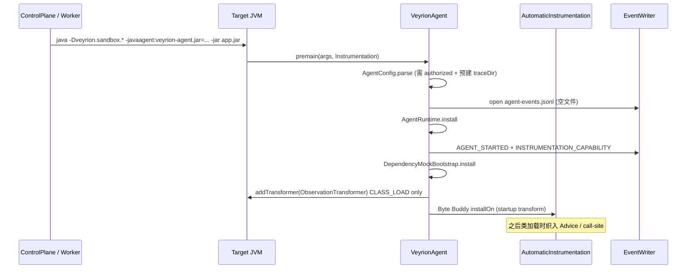
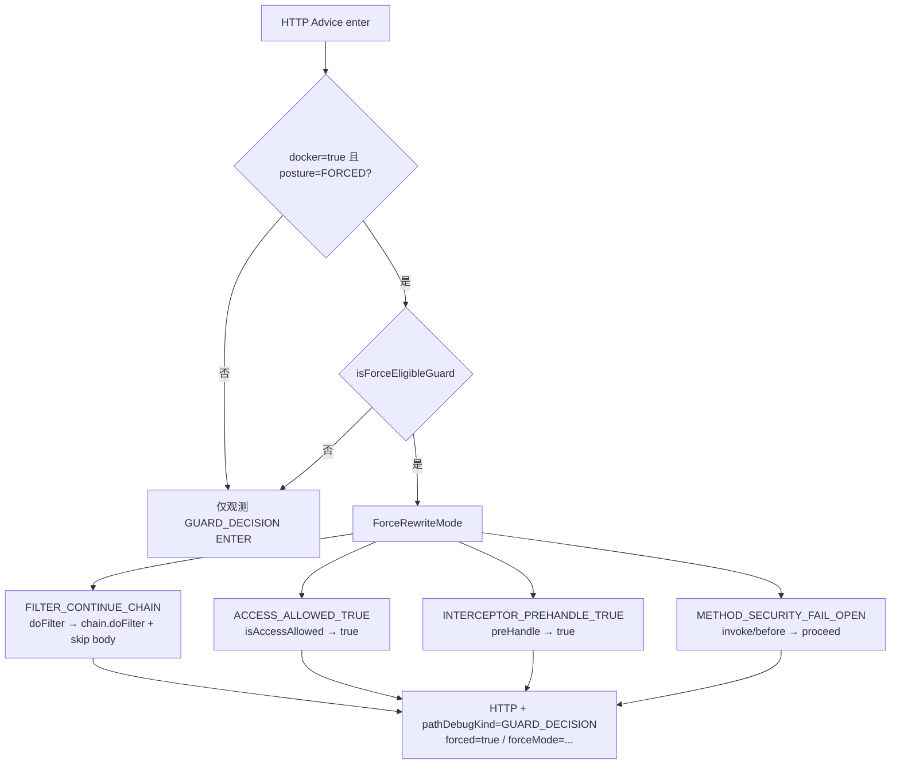
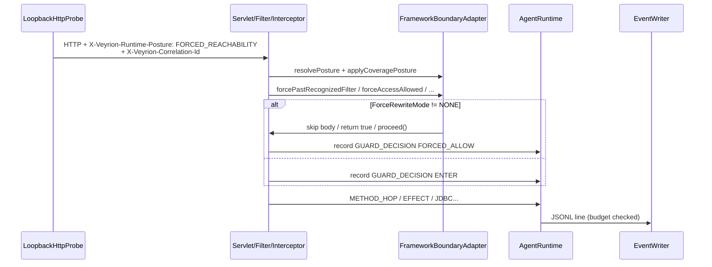

# Veyrion JVM Observation Agent

本模块是 **Sensor Agent**：在授权 Docker 沙箱（`TRUSTED_DOCKER`）内对 Spring Boot 可执行 JAR 做字节码观测与有界 FORCED 短接，写出 `agent-events.jsonl`。它**不是**沙箱边界、安全策略引擎、控制面或漏洞判定器。

产品级审计流水线模型见 [AUDIT_FLOW.md](../docs/AUDIT_FLOW.md)（产品模型文档，**不以代码对齐改写**）。Agent 只覆盖其中「Docker Sandbox + Framework Boundary + Sensor」切片。当前代码执行与模型的差距见 [AUDIT_FLOW_CODE_GAP.md](AUDIT_FLOW_CODE_GAP.md)。架构红线见 [ADR-0004](../docs/adr/0004-sandbox-posture-vs-agent-bypass.md)。

---

## 目录

1. [是什么 / 不是什么](#1-是什么--不是什么)
2. [启动与 Attach 生命周期](#2-启动与-attach-生命周期)
3. [请求姿态与 FORCED 短接管线](#3-请求姿态与-forced-短接管线)
4. [插桩范围](#4-插桩范围)
5. [事件预算与降噪](#5-事件预算与降噪)
6. [配置（系统属性 / Agent 参数）](#6-配置系统属性--agent-参数)
7. [依赖替身与探针辅助类](#7-依赖替身与探针辅助类)
8. [与控制面 / 沙箱的交互](#8-与控制面--沙箱的交互)
9. [构建、测试与镜像重建](#9-构建测试与镜像重建)
10. [ADR-0004 红线](#10-adr-0004-红线)
11. [关键类目录图](#11-关键类目录图)
12. [与 AUDIT_FLOW 模型差距](#12-与-audit_flow-模型差距)

---

## 1. 是什么 / 不是什么

| 是 | 不是 |
|----|------|
| Java 17 `premain` / `agentmain` 观测 Agent（Byte Buddy） | 沙箱 / 网络隔离 / 权限边界 |
| 记录 Entry / MethodHop / Guard / Effect / Dependency / Exit | 单独升 `DYNAMIC_CONFIRMED` / `VERIFIED` |
| Docker-only 对**已识别** auth guard 的 DecisionShape 短接 | Bypass Zoo（逐组件 fail-open） |
| 有界 JDBC/Redis/MySQL 替身（World Pack 语义） | 真实业务状态 / License / 完整 World Pack |
| 写出 JSONL，供 Worker 投影为 PathRun/PathTrace | Control Plane、AI 角色或报告生成 |

类注释原话：`VeyrionAgent` — *「Minimal Java 17 observation agent. It is not a sandbox or a security boundary.」*

---

## 2. 启动与 Attach 生命周期

Manifest（`pom.xml` shade jar）：

- `Premain-Class` / `Agent-Class` → `com.aq.jvmsentinel.instrumentation.VeyrionAgent`
- `Can-Redefine-Classes=false`，`Can-Retransform-Classes=false`（仅启动期插桩，不重变换已加载类）



失败时：若已 `install` 则 `AgentRuntime.uninstall` 并关闭 writer，再抛出异常（fail-closed）。

---

## 3. 请求姿态与 FORCED 短接管线

### 3.1 姿态解析

仅当 `-Dveyrion.sandbox.docker=true` 时启用姿态逻辑（`FrameworkBoundaryAdapter.sandboxEnabled`）。

| 来源 | 键 |
|------|-----|
| 请求头（优先） | `X-Veyrion-Runtime-Posture`（由 `LoopbackHttpProbe` 写入） |
| JVM 属性（回退） | `veyrion.sandbox.runtimePosture` |

合法值：`UNAUTH` · `COVERAGE_POSTURE` · `FORCED_REACHABILITY` · `BYPASS`。非 Docker 时 `resolvePosture` 固定为 `UNAUTH`（不短接）。

- **UNAUTH**：真实撞墙，记录 `GUARD_DECISION`。
- **COVERAGE_POSTURE**：注入扫描 Principal / SecurityContext / session 种子（best-effort）。
- **FORCED_REACHABILITY**：在 COVERAGE 种子之上，对合格 guard 做 DecisionShape 改写。
- **BYPASS**：姿态位存在；是否发探针由控制面候选决定，Agent 侧不单独实现绕过逻辑。

### 3.2 FORCED 短接（DecisionShape）



**Allowlist 优先**：`-Dveyrion.sandbox.forcedGuardTypeNames`（CSV，最多 48 个类型）非空时，只匹配目录类型；为空时回退启发式（Shiro authc/authz、Spring Security web filter、Sa-Token、JWT/Token Filter/Interceptor、License/Feature 等）。

**始终排除**：sanitizer / XSS / CSRF / SQL injection filter；基础设施 filter（CORS、CharacterEncoding…）；鉴权**容器** filter（`AbstractShiroFilter` / `SpringShiroFilter` 等——跳过它们会挂死请求）。

强达结果在控制面投影为 **`INSTRUMENTATION_REACHABILITY`**（见 `PathTraceProjector` / `FindingRuntimeEnricher`），Agent 事件本身写 `provenanceKind=AGENT_INSTRUMENTED`、`verificationStatus=DYNAMIC_SUSPECTED`，**从不**升 `VERIFIED`。

### 3.3 请求期事件流（FORCED）



---

## 4. 插桩范围

`AutomaticInstrumentation` 用 Byte Buddy；匹配规则：

1. **HTTP 可观测面**（**忽略** `classPrefix`）：Servlet / Filter / Interceptor / AccessControl / MethodSecurityInterceptor 形状或层次匹配——保证鉴权墙在 controller 包外也能留下 HTTP 证据。
2. **应用类型**（`classPrefix` + 内置 exclude）：MethodHop、Spring `@*Mapping`、方法安全注解、JDBC `Statement.execute*`、依赖 call-site（HTTP client / JNDI / Process / File / Class.forName / QLExpress…）。
3. **CLASS_LOAD**：`ObservationTransformer` 仅记录，不改字节码；仍受 `classPrefix` 约束。
4. **分支覆盖**（可选）：`veyrion.coverage.enabled=true` 且类型在 prefix 内时织入 `BranchCoverageInstrumentation`。

内置 exclude 含 `org/springframework/`、`org/apache/`、Druid、logback 等，避免 fat JAR 全量织入导致 StackMap VerifyError。HTTP 面通过 `isHttpObservabilityType` 仍可匹配 Spring/Shiro filter。

**Bootstrap JDK 类不变换**；对 JDK API 的观测在**应用 call-site** 插入 `AgentRuntime.recordInstrumentedCall`。

Effect 映射（`AgentRuntime.primaryEffectKind`）：JDBC→SQL/SSRF、JNDI、CLASS_LOADING、DESERIALIZATION、EXPRESSION、PROCESS、FILE、HTTP_CLIENT→SSRF 等；细节落在 `pathDebugKind=EFFECT_TRIGGERED` + `effectKind`。

---

## 5. 事件预算与降噪

| 控制 | 默认 / 上限 | 行为 |
|------|-------------|------|
| `maxEvents` | 10_000 / 100_000 | 超限后写一次 `TRACE_BUDGET_EXHAUSTED` 并停止 |
| `maxBytes` | 8 MiB / 64 MiB | 同上 |
| METHOD_HOP / 请求 | 64 | `AgentRuntime.MAX_METHOD_HOPS_PER_REQUEST` |
| XSS / CGLIB 过滤 | — | 丢弃 `*HtmlFilter*`、`.xss.`、`$$EnhancerBy` / `$$SpringCGLIB$$` 等 hop |
| Detail 字段 | ≤16 键，值 ≤256 | 敏感键（password/token/…）→ `[REDACTED]` |

事件 schema：`schemaVersion=1`，文件名固定 `agent-events.jsonl`（须新建或空文件）。

---

## 6. 配置（系统属性 / Agent 参数）

### 强制系统属性（缺一即拒绝启动）

| 属性 | 含义 |
|------|------|
| `veyrion.sandbox.traceDir.authorized=true` | 控制面授权写 trace |
| `veyrion.sandbox.traceDir` | 已存在、非符号链接目录 |

### Agent 参数（`-javaagent:jar=k=v,k=v`）

| 参数 | 说明 |
|------|------|
| `maxBytes` / `maxEvents` | 输出预算 |
| `classPrefix` | 应用插桩前缀（`.` 或 `/`）；控制面由 `InstrumentationClassPrefix` 从入口包推导 |
| `excludePrefixes` | 额外排除，`;` 分隔 |
| `dependencyMock` | 启用替身（也可读 `-Dveyrion.sandbox.dependencyMock`） |
| `veyrion.coverage.enabled` | 分支覆盖 |
| `veyrion.worldPack.dependencyMode` | `MOCK_CONTINUE`（默认）或 `OBSERVE_FAIL` |

### 控制面注入的常见 `-D`（见 `ExternalArtifactTaskExecutor`）

| 属性 | 作用 |
|------|------|
| `veyrion.sandbox.docker=true` | 启用姿态 / FORCED |
| `veyrion.sandbox.forcedGuardTypeNames` | GuardSurface 目录 CSV |
| `veyrion.sandbox.forcedGuardCatalogTruncated=true` | 目录截断可见标记 |
| `veyrion.worldPack.dependencyMode` | World Pack 依赖模式 |
| `veyrion.coverage.enabled=true` | 覆盖（沙箱默认开） |
| Quartz `instanceId` 等 | 断网容器启动缓解 |

容器内 Agent 路径：`/opt/veyrion/agent/veyrion-agent.jar`。

---

## 7. 依赖替身与探针辅助类

| 组件 | 职责 |
|------|------|
| `DependencyMockBootstrap` | 注册 `VeyrionMockDriver`；`MOCK_CONTINUE` 时启动 loopback Redis(:6379)/MySQL(:3306) stub；`OBSERVE_FAIL` 仍注册 mock JDBC 以便记录 SQL 后失败 |
| `VeyrionMock*` | 内存 JDBC Connection/Statement/ResultSet |
| `LoopbackRedisStub` / `LoopbackMysqlStub` | 协议子集，供 Boot 健康检查/连接池 |
| `QuartzInstanceIdFailOpen` | 避免 deny-all DNS 导致 Quartz 起不来 |
| `LoopbackHttpProbe` | 容器内 loopback 刺激；batch 双波（快 800/1500ms + 慢重试）；写 `probe-events.jsonl` |
| `WaitHttpReady` / `ProcessListenPorts` | 等进程 LISTEN 并分类 HTTP 端口 |

替身结果标注 `RULE_GENERATED` / `SERVER_FIXED_POLICY`，不能被叙述为真实环境验证。

---

## 8. 与控制面 / 沙箱的交互

```text
ControlPlane startAudit / enqueueDynamic
  → ProbePlanService（entry × 参数 × posture；GuardSurfaceCatalog → forcedGuardTypeNames）
  → ExternalArtifactTaskExecutor（TRUSTED_DOCKER，--network none）
  → java -javaagent:/opt/veyrion/agent/veyrion-agent.jar=... -jar artifact
  → WaitHttpReady → LoopbackHttpProbe --batch
  → merge agent-events.jsonl + probe-events.jsonl
  → AgentJsonlTraceConverter → TraceProjectionService → PathRun / PathTrace
```

- **无宿主回退**：沙箱不可用 → `DYNAMIC_DISABLED` / 静态结果；不得在宿主机加载被测 JAR。
- **`TRUSTED_DOCKER`**：受信本地 JAR 调试（Docker Desktop runc + network none），**不是**恶意制品强化隔离；`VerifiedStatusGate` 对 TRUSTED_DOCKER 永不升 `VERIFIED`。
- Agent 切片在**代码阶段机**中对应确定性阶段 **`DYNAMIC_OBSERVATION`**（非 AI），位于首次 `AUTH_ANALYSIS` 与 `AUTH_BYPASS_CONFIRM` 之间。产品模型 [AUDIT_FLOW.md](../docs/AUDIT_FLOW.md) 将该段叙述为「Docker Sandbox + Sensor」与 AUTH 续跑之间的动态观察；命名与回环差异见 [AUDIT_FLOW_CODE_GAP.md](AUDIT_FLOW_CODE_GAP.md)。

---

## 9. 构建、测试与镜像重建

```bash
# 模块包（shade：Byte Buddy 重定位到 com.aq.jvmsentinel.internal.bytebuddy）
mvn -f agent/pom.xml package

# 产物
# agent/target/veyrion-jvm-agent-0.1.0-SNAPSHOT.jar
```

Acceptance（`exec-maven-plugin`，`test` 阶段）：

- `AgentAcceptanceTest`
- `ProtocolSubstituteAcceptanceTest`
- `LoopbackHttpProbeAcceptanceTest`
- `PathDebugSensorAcceptanceTest`
- `ForcedReachabilityGuardAcceptanceTest`
- `MethodHopBudgetAcceptanceTest`

**镜像如何吃到新 Agent jar**（`sandbox-pack/artifact-runtime.Dockerfile`）：

```dockerfile
COPY agent/… → mvn package → COPY jar → /opt/veyrion/agent/veyrion-agent.jar
```

重建：

```powershell
# Windows：强制重建 runtime 并启动
.\Start-Veyrion.ps1 -WithDockerRuntime -RebuildRuntimeImage

# 或仅 sandbox-pack
.\sandbox-pack\Start-SandboxPack.ps1   # 无 -SkipRuntimeBuild 时 docker build + push digest
```

若已存在 `sandbox-pack/.runtime/state.json` 且未加 `-RebuildRuntimeImage`，会 **跳过** runtime 构建——改 Agent 后必须重建镜像，否则容器仍用旧 digest。

---

## 10. ADR-0004 红线

摘自已接受 ADR（本地 `docs/adr/0004-sandbox-posture-vs-agent-bypass.md`）：

1. Agent = **Sensor**，禁止扩大 Bypass Zoo。
2. FORCED 仅 Docker + 服务端固定策略 + 已识别 guard；**禁止**短接 sanitizer / 业务不变量。
3. 强达必须标 `INSTRUMENTATION_REACHABILITY`，不能单独升 `DYNAMIC_CONFIRMED` / `VERIFIED`。
4. 沙箱失败**不得**回退宿主执行。
5. AI/前端不能提供命令、镜像、挂载、网络、UID 或预算。

---

## 11. 关键类目录图

```text
agent/
├── pom.xml                          # shade jar + acceptance exec
└── src/main/java/com/aq/jvmsentinel/
    ├── instrumentation/
    │   ├── VeyrionAgent.java              # premain / agentmain
    │   ├── AgentConfig.java               # 参数与授权目录
    │   ├── AgentRuntime.java              # 事件 API、correlation、METHOD_HOP 预算
    │   ├── EventWriter.java               # JSONL + 预算
    │   ├── ObservationTransformer.java    # CLASS_LOAD（不改字节码）
    │   ├── AutomaticInstrumentation.java  # Byte Buddy + 全部 Advice
    │   ├── FrameworkBoundaryAdapter.java  # 姿态 / FORCED DecisionShape
    │   ├── PathDebugDetail.java           # pathDebugKind 标记
    │   ├── BranchCoverageInstrumentation.java
    │   ├── CoverageEventSerializer.java
    │   └── mock/
    │       ├── DependencyMockBootstrap.java
    │       ├── VeyrionMockDriver.java / Connection / Statement / …
    │       ├── LoopbackRedisStub.java
    │       ├── LoopbackMysqlStub.java
    │       └── QuartzInstanceIdFailOpen.java
    └── agent/
        ├── LoopbackHttpProbe.java         # loopback HTTP 刺激
        ├── WaitHttpReady.java             # 就绪探测
        └── ProcessListenPorts.java        # LISTEN 端口枚举
```

控制面侧相关（不在本模块，但驱动 Agent）：

- `worker.ExternalArtifactTaskExecutor` — javaagent 命令行
- `worker.InstrumentationClassPrefix` — `classPrefix`
- `analysis.experiment.GuardSurfaceCatalog` — `forcedGuardTypeNames`
- `control.service.ProbePlanService` — 探针 × posture 计划

---

## 12. 与 AUDIT_FLOW 模型差距

[AUDIT_FLOW.md](../docs/AUDIT_FLOW.md) 是产品模型文档，保持独立，**不**随代码「对齐」改写。

完整对照（阶段名、mermaid IR2 重算、PATH/TRIAGE 回 OBS、FORCED/Agent 切片、六 AI 角色）见专用差距文档：

→ **[AUDIT_FLOW_CODE_GAP.md](AUDIT_FLOW_CODE_GAP.md)**
