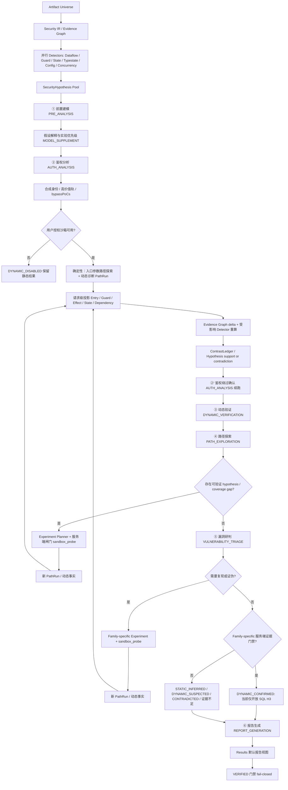

# Veyrion 审计流程

个人本地版的服务端固定流水线。模型只能在当前阶段读取受控上下文，不能跳过阶段、改变沙箱策略或把推断写成事实。路径实验、身份轨、超时分类与 SQL 门禁见 [PATH_EXPERIMENT_MODEL.md](PATH_EXPERIMENT_MODEL.md)。

六个固定 AI 角色：① PRE_ANALYSIS · ② AUTH_ANALYSIS（含动态证据后的续跑）· ③ DYNAMIC_VERIFICATION · ④ PATH_EXPLORATION · ⑤ VULNERABILITY_TRIAGE · ⑥ REPORT_GENERATION。Artifact Universe、Security IR、detector、Hypothesis Pool、Experiment Planner、PathRun 投影与 ContrastLedger 都是确定性服务端引擎，不占 AI 席位。

## 实战复核后的流程约束

2026-07-29 复核后，MVP 不再把“动态洪水有结果”当作漏洞发现主线。当前真实表现是：静态 sink/effect 仍比动态沙箱更可靠；动态启动、依赖替身、业务状态、鉴权材料和实验 payload 都不足，容易生成 `UNKNOWN/-1/MOCK` 噪声。后续流程按以下约束执行：

- 静态入口、调用边、sink/effect、guard 和 coverage gap 先形成候选；同时允许以任意入口为起点，枚举 0-n 个参数组合，沿运行时 Entry/Guard/Effect/State/Dependency 反推漏洞假设。
- “0 参数入口”是合法探索形态；“无语义盲发”不是。请求必须绑定 entry、身份轨、参数来源或空参数理由、expected/counter signal 和停止条件，才能参与路径探索。
- 动态不可达、启动失败、空 PathRun、`httpStatus=-1`、`outcomeClass=UNKNOWN` 或 `identityProvenance=MOCK` 不得单独进入 `DYNAMIC_SUSPECTED` 主列表。
- PATH/TRIAGE 必须优先消费静态高置信候选；动态失败只能生成 `UNREACHED`、counter evidence 或 coverage gap，不能覆盖静态 finding。
- 报告必须分开展示“静态疑似”“动态支持”“动态反证/不可达”和“未覆盖”，不得用大量动态失败制造漏洞噪声。

## 阶段契约

0. **确定性发现内核**先构建 Artifact Universe 和 Security IR，运行 dataflow、guard/ownership、state/sequence、typestate/API misuse、configuration/dependency、concurrency/resource detector，输出 `SecurityHypothesis` 与 coverage gap。检测器输出不是 Finding；unknown/unresolved 必须保留。
1. **前置建模**读取静态入口、依赖、权限、sink 和证据；补充入口必须标记 `MODEL_SUPPLEMENT`，不得覆盖 `FACT`。
2. **鉴权分析（AUTH_ANALYSIS）**必须先用真实代码查询查看方法切片、caller/callee、CFG、guard 和 dataflow，包括 Filter/Interceptor、安全注解、JWT/session/API key、skip URL、租户与角色判断，再产出鉴权方式、高价值入口、轨集合和**多个结构不同的绕过可行性 PoC**。PoC 必须是不同机制或不同过闸路径，不能只改同一 payload 的字面值。角色采用有界多轮：代码审阅 → PoC 草拟 → 证据缺口复查 → PoC 修订；鉴权面存在时目标不少于 3 个可执行或明确不可行的候选。服务端校验代码查询、PoC 结构和证据引用；绕过假设不得写成“已绕过”。
3. **沙箱动态观察**由服务端按身份轨执行校验后的入口参数路径探索计划（非 AI 角色）。计划可以覆盖任意入口和 0-n 参数组合，产出 PathRun（HTTP / Agent / SQL / Guard / Effect / State 事件与超时分类码）。合成身份失败的轨标记 `IDENTITY_UNAVAILABLE`。当前 MVP 禁止的是不绑定入口签名、参数来源、身份轨和观测目标的盲目洪水，不是禁止 0 参数探索。
4. **鉴权绕过确认**为 `AUTH_ANALYSIS` 的续跑/二次任务：仅在消费到动态 `AUTH_CHALLENGE` / 过闸等 PathRun 证据后，才可更新绕过结论；零动态证据不得确认绕过。
5. **动态验证**读取 `AUTH_BYPASS_FEASIBILITY` 与 PathRun，用 `sandbox_probe`（可带 AI `authorizationHeader`）在同一授权沙箱 loopback 内执行 PoC 并写回 PathRun。模型不能改变命令、网络、UID、挂载或预算；验证状态仍证据门禁。
6. **路径探索**消费已保存的 PathRun、SecurityHypothesis、Evidence Graph delta 与 coverage gap，可为 dataflow、guard、state、typestate、config 或 concurrency 假设调用 `sandbox_probe` 做定向动态验证，也可从 entry signature 推导 0-n 参数组合做探索。每次调用引用已有 hypothesis/entry/track 或序列计划，声明目标、expected/counter signal 和停止条件；新观察成功投影并触发受影响 detector 重算后才进入下一轮。参数、状态或身份缺失时保留 coverage gap，但不阻止合法的空参数路径探索。
7. **漏洞研判**围绕 hypothesis 和 PathRun，可调用 `sandbox_probe` 复现或证伪。只有成功关联入口/序列、请求、身份轨、Guard/Effect/State/Dependency 事件和 evidence refs 的结果才可参与动态结论；`BUSY`、`FAILED`、`QUEUED`、`UNKNOWN`、`UNREACHED` 或无投影结果不能算成功。当前只有 SQL H3 可升 `DYNAMIC_CONFIRMED`；其他 family 在独立门禁审计前最高为 `DYNAMIC_SUSPECTED`。不得由模型单独升 `VERIFIED`。
8. **报告生成**汇总 hypothesis、鉴权分析、动态验证、路径探索和漏洞研判，保留 `PROPOSED/SUPPORTED/CONTRADICTED/INSUFFICIENT_EVIDENCE` 与验证状态差异，并展示 coverage matrix、合成身份、MOCK 前置条件和 unresolved 区域。

提示词可在前端“模型服务”页分别编辑中文和 English 版本。任务创建时把选中的提示词写入不可变 policy snapshot；后续编辑只影响新任务，不能改变工具白名单、沙箱、网络、预算或验证等级。开始审计前须绑定全部六个 AI 角色。

## 超时分类展示

动态观察写入 PathRun 时使用固定分类：`BUSINESS_TIMEOUT` 表示应用已就绪但业务请求读响应超时；`COLD_START` 表示连接拒绝或启动窗口未监听；`ENGINE_BUSY` 表示平台 / 工作流 / 应用引擎忙碌、锁定或限流；`TRANSPORT_ERROR` 表示重置、EOF、协议错误等传输层失败。GUI 应把这些作为停止原因或重试提示，AI 只能引用这些事实标签，不能把任一超时单独写成 `DYNAMIC_CONFIRMED` 或 `VERIFIED`。

当前限制：V011 及后续迁移将 request-to-resource 幂等、流水线 cursor、有界 probe/实验计划元数据写入 SQLite；单节点恢复不是分布式 exactly-once。`TRUSTED_DOCKER` 不是恶意制品强化隔离。

## 当前实现偏差与必修项

实现状态、验收证据和待办只在 [MVP_BACKLOG.md](MVP_BACKLOG.md) 维护。本节只保留当前仍影响审计结论的边界：

1. `AcceptanceTestRunner` 是官方 curated gate，不等同于仓库全部 acceptance 类；最终报告必须给出实际执行数、断言数和跳过项。
2. `TRUSTED_DOCKER` 仅用于受信本地制品的开发调试，不是 hardened sandbox，也不能证明恶意制品隔离；gVisor/Kata 仍关闭。
3. 外部 Provider、真实供应商流式/限流/计费和真实多轮编排未验收；loopback Provider 证据不得外推。
4. `analysis.kernel` 是轻量有界内核。完整 SSA/IFDS/points-to、别名、反射/代理/JNI、深层依赖展开和生产入口召回仍存在 coverage gap；引入重型引擎必须走进程外边界和新 ADR。
5. Provider SPI 的 ArtifactNodes、MethodSummary、DynamicProbe 输出尚未全部进入主扫描投影；状态保持 `PARTIAL`，不得标记为完整 Provider 消费。
6. GUI 目前只有 TypeScript contract/build 验证，未完成手工视觉或 Playwright 回归。
