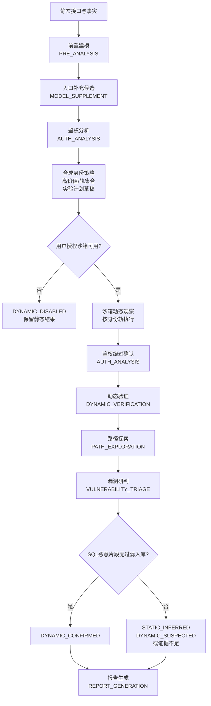

# Veyrion 审计流程

个人本地版的服务端固定流水线。模型只能在当前阶段读取受控上下文，不能跳过阶段、改变沙箱策略或把推断写成事实。路径实验、身份轨、超时分类与 SQL 门禁见 [PATH_EXPERIMENT_MODEL.md](PATH_EXPERIMENT_MODEL.md)。

## 阶段契约

1. **前置建模**读取静态入口、依赖、权限、sink 和证据；补充入口必须标记 `MODEL_SUPPLEMENT`，不得覆盖 `FACT`。
2. **鉴权分析（AUTH_ANALYSIS）**在洪水前产出：鉴权方式、合成身份策略、高价值入口与每入口轨集合、实验计划草稿。工具为只读事实 + 提议计划；不能改网络/挂载。绕过假设此时不得写成“已绕过”。
3. **沙箱动态观察**由服务端按身份轨执行校验后的实验计划（非 AI 角色）。产出 PathRun（HTTP / Agent / SQL 事件与超时分类码）。合成身份失败的轨标记 `IDENTITY_UNAVAILABLE`。
4. **鉴权绕过确认**为 `AUTH_ANALYSIS` 的续跑/二次任务：仅在消费到动态 `AUTH_CHALLENGE` / 过闸等 PathRun 证据后，才可更新绕过结论；零动态证据不得确认绕过。
5. **动态验证**读取 PathRun 与先前推断，可调用 `sandbox_probe` 提出同一授权沙箱 loopback 内的有界发包；服务端执行并写回 PathRun。模型不能改变命令、网络、UID、挂载或预算。
6. **路径探索**只消费已保存的 PathRun、前置建模与鉴权/动态验证推断；未执行候选只能作为假设。
7. **漏洞研判**围绕 PathRun：无入口命中、参数绑定、触发点与可重放实验卡时不得宣称漏洞存在。SQL 默认走 `DYNAMIC_SUSPECTED`；仅当服务端判定满足 [PATH_EXPERIMENT_MODEL.md](PATH_EXPERIMENT_MODEL.md) §7 的 H3 门禁时升 `DYNAMIC_CONFIRMED`。不得由模型单独升 `VERIFIED`。
8. **报告生成**汇总鉴权分析、动态验证、路径探索、漏洞研判，保留  
   `STATIC_INFERRED` / `DYNAMIC_SUSPECTED` / `DYNAMIC_CONFIRMED` / `VERIFIED` / `UNREACHED` 差异，并展示合成身份与 MOCK 前置条件。

提示词可在前端“模型服务”页分别编辑中文和 English 版本。任务创建时把选中的提示词写入不可变 policy snapshot；后续编辑只影响新任务，不能改变工具白名单、沙箱、网络、预算或验证等级。开始审计前须绑定全部六个 AI 角色。

当前限制：V011 及后续迁移将 request-to-resource 幂等、流水线 cursor、有界 probe/实验计划元数据写入 SQLite；单节点恢复不是分布式 exactly-once。`TRUSTED_DOCKER` 不是恶意制品强化隔离。
