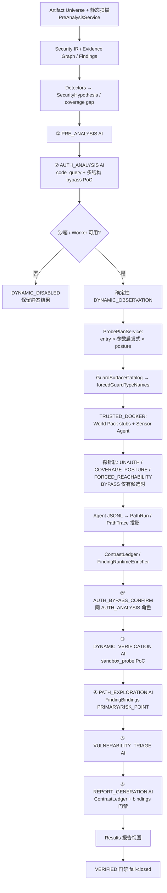

# Veyrion 审计流程

个人本地版的服务端固定流水线。模型只能在当前阶段读取受控上下文，不能跳过阶段、改变沙箱策略或把推断写成事实。路径实验、身份轨、超时分类与 SQL 门禁见 [PATH_EXPERIMENT_MODEL.md](PATH_EXPERIMENT_MODEL.md)。Docker 内 Sensor Agent 行为见 [agent/README.md](../agent/README.md)。

## 代码权威阶段机

编排权威：`AuditPipelineCoordinator`（八个 `PipelineStage`）。AI 角色仍是六个 `AgentRole`；其中 `AUTH_ANALYSIS` 角色会跑两次（首次鉴权 + 动态后的绕过确认）。

```text
POST /projects/{id}/audit-runs
  → createOrReplayScan          [确定性静态：PreAnalysisService，非 AI]
  → PRE_ANALYSIS                [AI]
  → AUTH_ANALYSIS               [AI]
  → DYNAMIC_OBSERVATION         [Worker / TRUSTED_DOCKER，非 AI]
  → AUTH_BYPASS_CONFIRM         [AI，角色仍为 AUTH_ANALYSIS]
  → DYNAMIC_VERIFICATION        [AI]
  → PATH_EXPLORATION            [AI]
  → VULNERABILITY_TRIAGE        [AI]
  → REPORT_GENERATION           [AI]
```

手工 `POST …/scans` 只做静态扫描，**不会**启动 AI 或 Docker。动态任务也可经 `POST …/dynamic-tasks` 单独入队，但完整审计以 `audit-runs` + pipeline cursor 为准。



六个固定 AI 角色：① PRE_ANALYSIS · ② AUTH_ANALYSIS（含 `AUTH_BYPASS_CONFIRM` 续跑）· ③ DYNAMIC_VERIFICATION · ④ PATH_EXPLORATION · ⑤ VULNERABILITY_TRIAGE · ⑥ REPORT_GENERATION。

确定性服务端引擎（不占 AI 席位）：静态扫描、`ProbePlanService` / `PostureExperimentCompiler` / `EntryParameterExperimentCompiler` / `ProbeParameterHeuristics`、`GuardSurfaceCatalog`、`DYNAMIC_OBSERVATION` Worker、`AgentJsonlTraceConverter` / `TraceProjectionService`、`ContrastLedger`、`FindingRuntimeEnricher`、`FindingBindings` 报告分区、`DynamicConfirmedGate` / `VerifiedStatusGate`。

## 实战复核后的流程约束

2026-07-29 复核后，MVP 不再把“动态洪水有结果”当作漏洞发现主线。当前真实表现是：静态 sink/effect 仍比动态沙箱更可靠；动态启动、依赖替身、业务状态、鉴权材料和实验 payload 都不足，容易生成 `UNKNOWN/-1/MOCK` 噪声。后续流程按以下约束执行：

- 静态入口、调用边、sink/effect、guard 和 coverage gap 先形成候选；同时为任意入口编译探针计划，枚举 0-n 个参数组合（`ProbeParameterHeuristics`：表达式类参数名/路由倾向样本 `"1"`，并 `preferHonestQuery` 丢弃未绑定真实参数名的误编译 query）。
- “0 参数入口”是合法探索形态；“无语义盲发”不是。请求必须绑定 entry、身份轨/姿态、参数来源或空参数理由、expected/counter signal 和停止条件，才能参与路径探索。
- 动态默认采用三轨：`UNAUTH` 证明鉴权墙；`COVERAGE_POSTURE` 尽量通过标准姿态进入业务；`FORCED_REACHABILITY` 默认开启但仅限 Docker 沙箱、只强达 `GuardSurfaceCatalog` allowlist（空则启发式）中的鉴权/权限/License/feature guard，并标 `INSTRUMENTATION_REACHABILITY`。`BYPASS` 只按绕过候选执行。
- FORCED 短接形态由 Agent `ForceRewriteMode` 限定：`FILTER_CONTINUE_CHAIN` / `ACCESS_ALLOWED_TRUE` / `INTERCEPTOR_PREHANDLE_TRUE` / `METHOD_SECURITY_FAIL_OPEN`；禁止短接 sanitizer。目录截断时可见 `GUARD_CATALOG_TRUNCATED`。
- 动态成功不以 HTTP 2xx 为唯一标准。若请求最终因数据库不可达、缺表、缺 license、缺业务状态或依赖失败而退出，但此前已观察到参数绑定、业务方法或 sink/effect，必须保留 PathTrace 并将依赖作为退出原因。
- 动态不可达、启动失败、空 PathRun、`httpStatus=-1`、`outcomeClass=UNKNOWN` 或 `identityProvenance=MOCK` 不得单独进入 `DYNAMIC_SUSPECTED` 主列表。
- PATH/TRIAGE 必须优先消费静态高置信候选；动态失败只能生成 `UNREACHED`、counter evidence 或 coverage gap，不能覆盖静态 finding。
- PATH 产出 `findingBindings[]`（`reportRole=PRIMARY|RISK_POINT`）；REPORT 强制写入「漏洞」与「风险点」分区——鉴权缺口且无配合链时降为风险点，FORCED ENTRY_HIT 为「强达路径风险材料」，不得写成匿名 exploit。
- 报告必须分开展示“静态疑似”“动态支持”“动态反证/不可达”和“未覆盖”，不得用大量动态失败制造漏洞噪声。

## 阶段契约

0. **确定性发现内核**先构建 Artifact Universe 和 Security IR（`createOrReplayScan` / `PreAnalysisService`），运行 dataflow、guard/ownership、state/sequence、typestate/API misuse、configuration/dependency、concurrency/resource detector，输出 `SecurityHypothesis` 与 coverage gap。检测器输出不是 Finding；unknown/unresolved 必须保留。完整「每次 PathRun 后 IR delta + 全量 detector 重算」仍为 **PARTIAL**——当前以 ContrastLedger 对照、假设生命周期和读时 enrichment 为主，不是闭环重算引擎。
1. **前置建模（PRE_ANALYSIS）**读取静态入口、依赖、权限、sink 和证据；补充入口必须标记 `MODEL_SUPPLEMENT`，不得覆盖 `FACT`。
2. **鉴权分析（AUTH_ANALYSIS）**必须先用真实代码查询查看方法切片、caller/callee、CFG、guard 和 dataflow，包括 Filter/Interceptor、安全注解、JWT/session/API key、skip URL、租户与角色判断，再产出鉴权方式、高价值入口、轨集合和**多个结构不同的绕过可行性 PoC**。PoC 必须是不同机制或不同过闸路径，不能只改同一 payload 的字面值。角色采用有界多轮：代码审阅 → PoC 草拟 → 证据缺口复查 → PoC 修订；鉴权面存在时目标不少于 3 个可执行或明确不可行的候选。服务端校验代码查询、PoC 结构和证据引用；绕过假设不得写成“已绕过”。
3. **沙箱动态观察（DYNAMIC_OBSERVATION）**由服务端按姿态执行校验后的入口参数计划（非 AI 角色；详见 [PATH_EXPERIMENT_MODEL.md](PATH_EXPERIMENT_MODEL.md) §3.1 与 [agent/README.md](../agent/README.md)）：有界 `UNAUTH` 撞墙/意外过闸；`COVERAGE_POSTURE` 以标准扫描身份姿态尽量进入业务；`FORCED_REACHABILITY` 默认开启但仅限 Docker 沙箱和已识别 guard；`BYPASS_CANDIDATE` 仅确认绕过。Worker 经 `ExternalArtifactTaskExecutor` 启动 digest-pinned artifact-runtime，挂 `-javaagent` 与 `forcedGuardTypeNames`。产出 PathRun/PathTrace 并标注 `authRequirement`、`postureKind`、World Pack 状态和退出原因。禁止的是无计划盲洪水，不是禁止 0 参数、流通覆盖或强达探索。
4. **鉴权绕过确认（AUTH_BYPASS_CONFIRM）**为 pipeline 显式阶段，复用 `AUTH_ANALYSIS` 角色：消费动态 PathRun 后更新绕过结论（`HYPOTHESIS` / `DYNAMIC_CONTRAST` / `INSUFFICIENT_EVIDENCE`）。零 `AUTH_CHALLENGE`/过闸类证据不得确认绕过；coordinator 可能在“已有 PathRun 或先前 AUTH 任务”时进入确认模式，但硬门禁仍在 `evaluateBypassConfirmation`。
5. **动态验证（DYNAMIC_VERIFICATION）**读取 `AUTH_BYPASS_FEASIBILITY` 与 PathRun，用 `sandbox_probe`（可带 AI `authorizationHeader`）在同一授权沙箱 loopback 内执行 PoC 并写回 PathRun。模型不能改变命令、网络、UID、挂载或预算；验证状态仍证据门禁。未探测时服务端可 re-ask 后自动入队探针。
6. **路径探索（PATH_EXPLORATION）**消费已保存的 PathRun/PathTrace、SecurityHypothesis 与 coverage gap，可为明确 gap 调用 `sandbox_probe` 做定向动态验证。每次调用引用已有 hypothesis/entry/track/posture，声明目标、expected/counter signal 和停止条件。结论须含 `findingBindings[]`（API + PoC + `reportRole`），供报告分区。阶段机在 job COMPLETED 后**顺序推进** TRIAGE（mermaid 中的“无 hypothesis 则跳过”是研判策略，不是 coordinator 分支跳过）。
7. **漏洞研判（VULNERABILITY_TRIAGE）**围绕 hypothesis 和 PathTrace 做**延迟组链**（见 PATH_EXPERIMENT_MODEL §3.2）：绕过确认 + 流通/强达轨 sink 才可报利用链；仅 COVERAGE_POSTURE 可达报鉴权门控风险，FORCED_REACHABILITY 只能作为强达路径风险材料，永不报匿名 exploit。只有成功关联入口/序列、请求、姿态、参数流、Guard/Effect/State/Dependency/Exit 与 evidence refs 的结果才可参与动态结论；`BUSY`/`FAILED`/`QUEUED`/`UNKNOWN` 或无投影不算成功。当前只有 SQL H3 可升 `DYNAMIC_CONFIRMED`；其他 family 在独立门禁审计前最高 `DYNAMIC_SUSPECTED`。不得由模型单独升 `VERIFIED`。
8. **报告生成（REPORT_GENERATION）**汇总 hypothesis、鉴权分析、动态验证、路径探索和漏洞研判；强制消费 ContrastLedger 与 PATH 的 FindingBindings（`PRIMARY` → 漏洞区，`RISK_POINT` → 「风险点」），保留验证状态差异，并按入口展示最深 PathTrace、参数流、sink/effect、World/Posture/强达限制、MOCK 前置条件和 unresolved 区域。

提示词可在前端“模型服务”页分别编辑中文和 English 版本。任务创建时把选中的提示词写入不可变 policy snapshot；后续编辑只影响新任务，不能改变工具白名单、沙箱、网络、预算或验证等级。开始审计前须绑定全部六个 AI 角色。

## 超时分类展示

动态观察写入 PathRun 时使用固定分类：`BUSINESS_TIMEOUT` 表示应用已就绪但业务请求读响应超时；`COLD_START` 表示连接拒绝或启动窗口未监听；`ENGINE_BUSY` 表示平台 / 工作流 / 应用引擎忙碌、锁定或限流；`TRANSPORT_ERROR` 表示重置、EOF、协议错误等传输层失败。GUI 应把这些作为停止原因或重试提示，AI 只能引用这些事实标签，不能把任一超时单独写成 `DYNAMIC_CONFIRMED` 或 `VERIFIED`。

当前限制：V011 及后续迁移将 request-to-resource 幂等、流水线 cursor、有界 probe/实验计划元数据写入 SQLite；单节点恢复不是分布式 exactly-once。`TRUSTED_DOCKER` 不是恶意制品强化隔离。

## 当前实现偏差与必修项

实现状态、验收证据和待办只在 [MVP_BACKLOG.md](MVP_BACKLOG.md) 维护。本节只保留当前仍影响审计结论的边界：

1. `AcceptanceTestRunner` 是官方 curated gate，不等同于仓库全部 acceptance 类；最终报告必须给出实际执行数、断言数和跳过项。
2. `TRUSTED_DOCKER` 仅用于受信本地制品的开发调试，不是 hardened sandbox，也不能证明恶意制品隔离；gVisor/Kata 仍关闭；沙箱失败不得回退宿主。
3. 外部 Provider、真实供应商流式/限流/计费和真实多轮编排未验收；loopback Provider 证据不得外推。
4. `analysis.kernel` 是轻量有界内核。完整 SSA/IFDS/points-to、别名、反射/代理/JNI、深层依赖展开和生产入口召回仍存在 coverage gap；引入重型引擎必须走进程外边界和新 ADR。
5. Provider SPI 的 ArtifactNodes、MethodSummary、DynamicProbe 输出尚未全部进入主扫描投影；状态保持 `PARTIAL`，不得标记为完整 Provider 消费。
6. 动态后「Evidence Graph delta + 受影响 Detector 全量重算」仍弱于目标闭环；ContrastLedger / FindingRuntimeEnricher / 假设修订是当前主反馈。
7. World Pack 业务种子、BYPASS 轨召回、完整 hypothesis→experiment 多轮仍 PARTIAL；Gateway/WebFlux/RPC 强达延后。
8. GUI 目前只有 TypeScript contract/build 验证，未完成手工视觉或 Playwright 回归。
