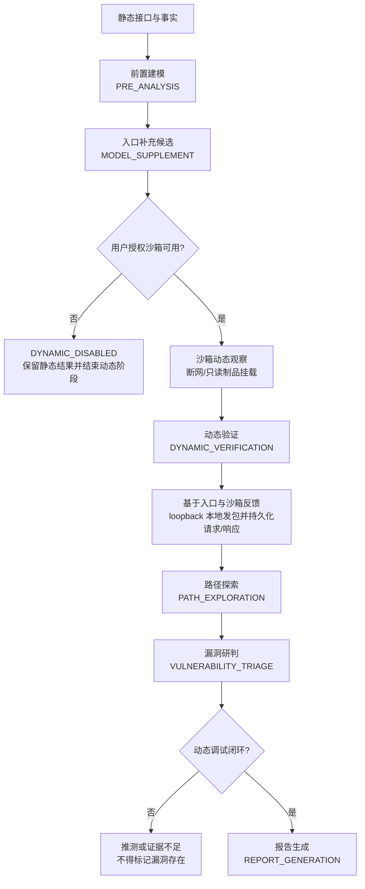

# Veyrion 审计流程

这是个人本地版的服务端固定流水线。模型只能在当前阶段读取受控上下文，不能跳过阶段、改变沙箱策略或把推断写成事实。

## 阶段契约

1. **前置建模**读取静态入口、依赖、权限、sink 和证据；补充入口必须标记 `MODEL_SUPPLEMENT`，不得覆盖 `FACT`。
2. **沙箱动态观察**由服务端根据静态入口生成有界计划。它不是 AI 角色，任务完成只表示受控执行结束。
3. **动态验证**读取前置入口与沙箱反馈参数，可调用 `sandbox_probe` 提出同一授权沙箱 loopback 内的无破坏本地发包；由服务端受控执行器实际发包，并保存请求、响应、入口命中、参数绑定、触发点以及 HTTP/Socket/URL/DNS/JNDI 尝试结果。`sandbox_probe` 对本 job 创建的任务会等待终态后再把 lifecycle 回传；若扫描上已有进行中任务，则返回 `BUSY/retryable`，不得把外来 task 伪绑到请求入口。流水线也会等待动态任务结束后才进入路径探索。模型不能直接获得网络、命令、挂载、UID 或预算权限。
   `sandbox_probe` 的 `candidateInputs` 只接受有界字符串；服务端将其解析为入口参数的 `name=value` 提示，进行长度、字符和请求数裁剪（最多 8 次），生成不可由模型改写的 probe plan。返回的 `probePlanId`/`taskId` 只是任务证据，实际请求/响应仍以沙箱 trace 投影为准。
4. **路径探索**只消费已保存的前置建模、动态验证和请求/响应结果；用户提示会注入这两类先验摘要（标记为不可信假设）。未执行候选只能作为假设。
5. **漏洞研判**必须同时看到入口命中、参数绑定、触发点执行和可重放动态调试闭环，才可以标记漏洞存在；否则保持 `STATIC_INFERRED`、`DYNAMIC_SUSPECTED` 或证据不足。
6. **报告生成**汇总前四个 AI 角色（前置建模、动态验证、路径探索、漏洞研判），保留 `STATIC_INFERRED`、`DYNAMIC_SUSPECTED`、`VERIFIED` 和 `UNREACHED` 的差异，不得升级结论。

提示词可在前端“模型服务”页分别编辑中文和 English 版本。任务创建时把选中的提示词写入不可变 policy snapshot；后续编辑只影响新任务，不能改变工具白名单、沙箱、网络、预算或验证等级。

当前限制：V011 已将 request-to-resource 幂等绑定、流水线 armed/stage cursor 和有界 probe plan 写入 SQLite；控制面重启可恢复未完成阶段并创建新 job，不改写旧的 `FAILED/PROCESS_RESTARTED` 记录。该语义是单节点恢复，不是分布式 exactly-once；其他删除/修改 mutation 尚未全部纳入统一持久化幂等。
